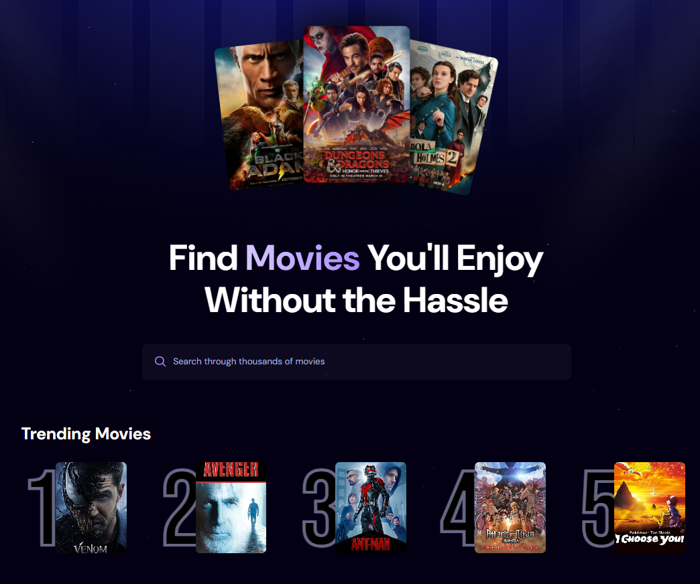

# 🎬 Movie Search App

A React-based web application that allows users to **search for movies**, view their **ratings and release year**, and **ranks movies** based on how many times they've been searched before.

---

## 🚀 Features

- 🔍 Search movies by title
- ⭐ View movie rating and 📅 release year
- 📊 Track and rank movies by user search count
- ⚡ Built with **React** and **Vite** for performance

---

## ⚠️ Important: `.env.local` & API Key

This project **requires an API key** to fetch movie data from the external API (e.g., OMDb or similar).
